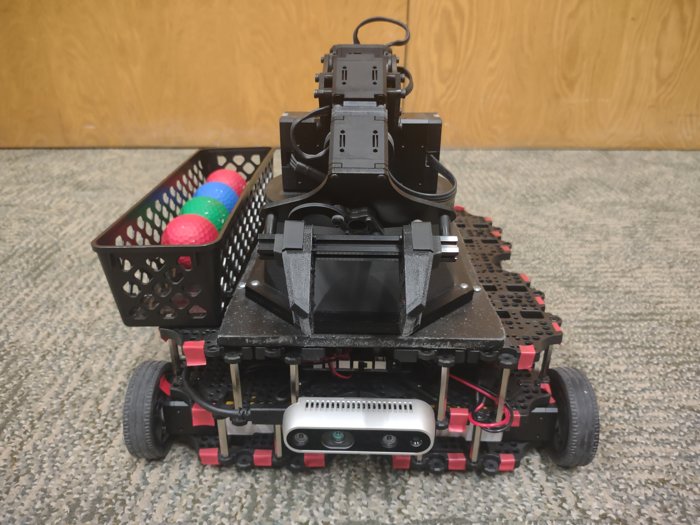
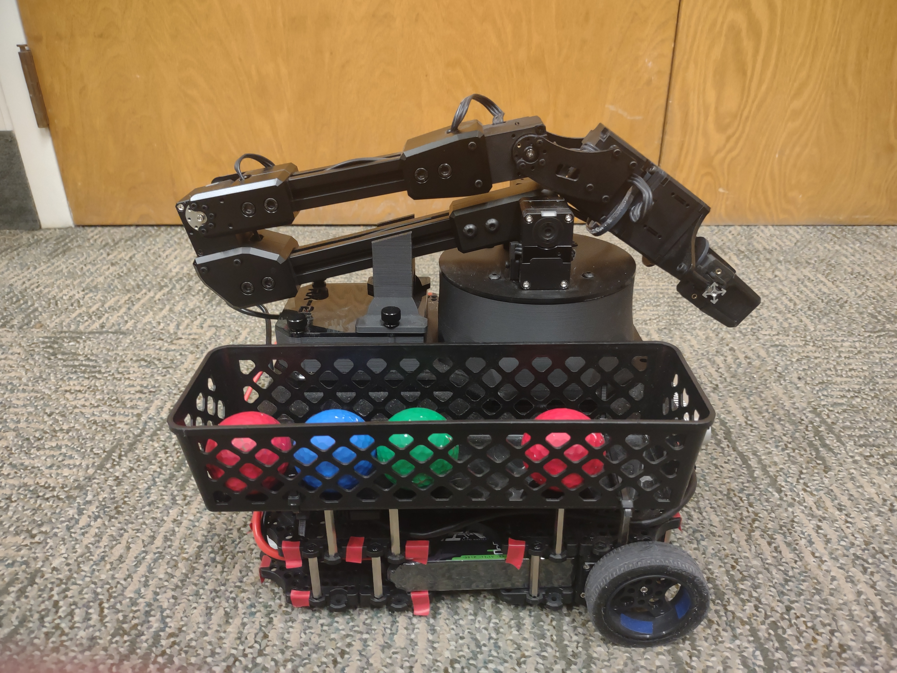
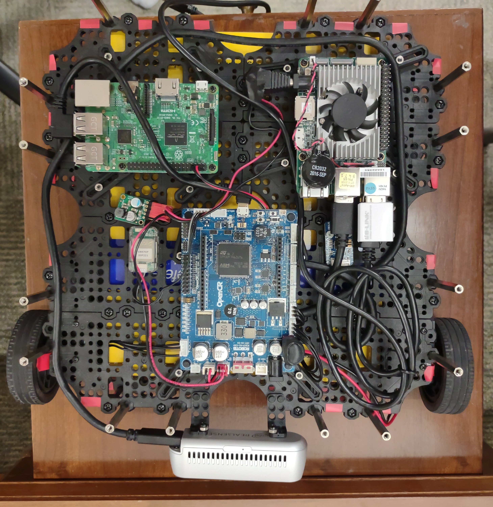
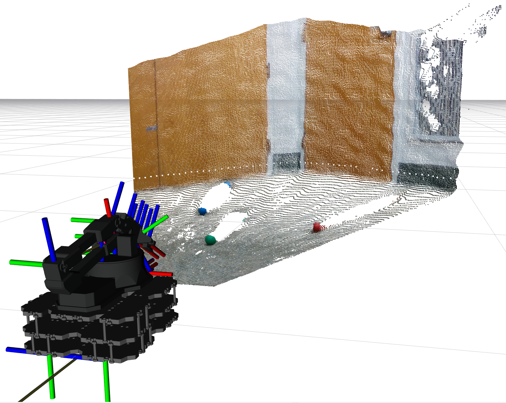

# trash_collection_robot

This package is used to program a garbage collection robot.
This package is designed to be used within a ROS 1 framework.

<video width="960" height="540" controls>
  <source src="pics/video.mp4" type="video/mp4">
</video>


## Hardware

The robot is composed on a [TurtleBot 3 Waffle](https://emanual.robotis.com/docs/en/platform/turtlebot3/features/) with a [ReactorX-200](https://docs.trossenrobotics.com/interbotix_xsarms_docs/specifications/rx200.html) 5-DOF manipulator.
Additionally, a [Intel RealSense D435](https://www.intelrealsense.com/depth-camera-d435/) camera is used to receive depth images of the surroundings.
Pieces of trash for collection are simulated with colored golf balls, and an Up
has been included on board for computations passed what the default [Raspberry Pi](https://www.raspberrypi.com/products/raspberry-pi-3-model-b/) is capable of.




## Installation

This package is intended to be used with [ROS 1 Noetic](https://wiki.ros.org/noetic).
If you are using Ubuntu 20.04 natively then follow the [native installation](#native-installation) instructions.
Otherwise we suggest installing the software in a [Docker](https://www.docker.com/) container, in which case follow the [Docker installation](#docker-installation) instructions.

### Native Installation

To install ROS Noetic, follow the instillation instructions [here](https://wiki.ros.org/noetic/Installation).
Now make a workspace.
In these instructions the workspace will be called `ros_ws`, but any name will do.
First, we need to clone this package into the `src` directory with the following command.
```bash
git clone git@gitlab.com:James.S/trash_collection_robot.git
```
Now we need to install the [Interbotix](https://www.interbotix.com/) dependencies into the same workspace with the following commands.
```bash
git clone -b noetic https://github.com/Interbotix/interbotix_ros_manipulators.git
rm interbotix_ros_manipulators/interbotix_ros_xsarms/CATKIN_IGNORE
git clone -b noetic https://github.com/Interbotix/interbotix_ros_toolboxes.git
rm interbotix_ros_toolboxes/interbotix_xs_toolbox/CATKIN_IGNORE
rm interbotix_ros_toolboxes/interbotix_common_toolbox/interbotix_moveit_interface/CATKIN_IGNORE
git clone -b noetic https://github.com/Interbotix/interbotix_ros_core.git
rm interbotix_ros_core/interbotix_ros_xseries/CATKIN_IGNORE
```
Finally install the ROS-based dependencies with the following command.
```bash
sudo apt install ros-noetic-dynamixel-sdk ros-noetic-pointcloud-to-laserscan ros-noetic-moveit-visual-tools ros-noetic-turtlebot3 ros-noetic-realsense2-camera -y
```
Now you are ready to build the workspace and run the code.

### Docker Installation

First you will need to install Docker with the following command.
```bash
sudo apt install docker.io -y
```
Now open the [Dockerfile](Docker/Dockerfile) provided and replace *user* on line 2 with your username.
Additionally, replace */home/${USER}/ros_ws* with the location of your catkin workspace.
Now build the docker container with the following command.
```bash
docker build Docker -t ros-noetic-container
```
Now start the Docker container with the following command.
```bash
docker run -it --rm --user=$(id -u $USER):$(id -g $USER) --env="DISPLAY" --volume="/etc/group:/etc/group:ro" --volume="/etc/passwd:/etc/passwd:ro" --volume="/etc/shadow:/etc/shadow:ro" --volume="/etc/sudoers.d:/etc/sudoers.d:ro" --net host -v /home:/home ros-noetic-container
```
This command starts the Docker container in interactive mode, sharing your host user and group IDs to avoid permission issues.
It also shares the necessary volumes and network configuration.

Within the Docker container, navigate the `src` directory of your catkin workspace.
Now clone all of the dependencies that are not included in the Docker container with the following commands.
```bash
git clone git@gitlab.com:James.S/trash_collection_robot.git
git clone -b noetic https://github.com/Interbotix/interbotix_ros_manipulators.git
rm interbotix_ros_manipulators/interbotix_ros_xsarms/CATKIN_IGNORE
git clone -b noetic https://github.com/Interbotix/interbotix_ros_toolboxes.git
rm interbotix_ros_toolboxes/interbotix_xs_toolbox/CATKIN_IGNORE
rm interbotix_ros_toolboxes/interbotix_common_toolbox/interbotix_moveit_interface/CATKIN_IGNORE
git clone -b noetic https://github.com/Interbotix/interbotix_ros_core.git
rm interbotix_ros_core/interbotix_ros_xseries/CATKIN_IGNORE
```
Now you are ready to build the workspace and run the code.

## Use

Before running, make sure that the `ROS_MASTER_URI` of the `env.sh` scrips in both the Raspberry Pi and Up Board are set to address of the computer you will be launching everything from.
Additionally, make sure that the `address` tags in the [launch/spin_up_bot.launch](launch/spin_up_bot.launch) file is set to the address of each device.
Now you should be able to start the program with the following command.
```bash
roslaunch trash_collection_robot run_hardware.launch
```
This will make the robot drive randomly around the room looking for any colored golf balls.
When a ball is found it will zero in on the ball until it is close enough to pick up.
Then the arm will pick the ball up and deposit it into the basket on the side of the bot before resuming its sweep of the room.
Additionally a RVIS window will open and show you what the RealSense camera is seeing along with a model of the robot.



